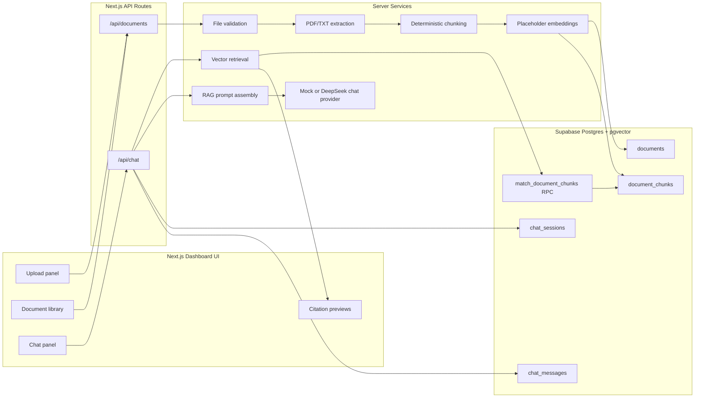

# AI Document Chat

A full-stack RAG portfolio app for uploading PDF/TXT documents, asking
questions about them, and returning document-grounded answers with source
citations.

The project is designed as a resume-ready example of document ingestion,
chunking, vector search, LLM orchestration, chat persistence, and a polished
dashboard UI. It is a local MVP, not a production SaaS product.

## Demo Preview

Screenshots are intentionally not checked in yet. Recommended screenshots before
publishing the repository:

1. Dashboard with the upload panel, document library, chat workspace, and
   evidence sidebar visible.
2. Successful TXT upload using
   `docs/sample-documents/demo-notes.txt`.
3. A completed chat answer with source citations rendered.

Suggested location:

```text
docs/screenshots/dashboard.png
docs/screenshots/upload-success.png
docs/screenshots/rag-answer.png
```

## Features

- PDF/TXT document upload API.
- TXT extraction and PDF text extraction through `pdf-parse`.
- Deterministic text chunking with chunk indexes and offsets.
- Supabase Postgres storage for documents, chunks, chat sessions, and messages.
- `pgvector` schema support for chunk embeddings and similarity search.
- RAG retrieval through a `match_document_chunks` RPC.
- Grounded answer generation through a pluggable chat provider interface.
- Optional DeepSeek chat provider configured through server-side environment
  variables.
- Mock chat provider for no-cost local development and automated tests.
- Dashboard UI with document staging, upload state, document library, chat
  messages, loading/error states, and citation previews.
- Unit, route, component, schema, and documentation-readiness tests.

## Tech Stack

- Next.js 16 App Router
- React 19
- TypeScript
- Tailwind CSS
- Supabase Postgres
- `pgvector`
- DeepSeek-compatible chat provider
- `pdf-parse`
- Vitest
- Testing Library

## Architecture



More detail: [docs/architecture.md](docs/architecture.md).

## RAG Workflow

1. A user uploads a PDF or TXT document from the dashboard.
2. The server validates file type, MIME type, PDF magic bytes, and basic TXT
   safety checks.
3. Text is extracted from the file.
4. Extracted text is split into deterministic chunks with metadata.
5. Chunks and placeholder embeddings are stored in Supabase.
6. A user submits a question through the chat UI.
7. The question is embedded with the same placeholder embedding provider.
8. The app calls `match_document_chunks` to retrieve relevant chunks.
9. Retrieved chunks are assembled into a grounded RAG prompt.
10. The configured chat provider returns an answer.
11. User and assistant messages are saved to `chat_messages`.
12. The UI renders the answer and source citations.

Current limitation: embeddings are deterministic placeholders. This validates
the ingestion, retrieval plumbing, persistence, prompt assembly, and citation
flow, but not production-grade semantic relevance. A real embedding provider is
a planned upgrade.

## Folder Structure

```text
src/app/
  api/chat/                 RAG chat API route
  api/documents/            Document upload/list API route
  page.tsx                  Dashboard entry point
src/components/
  dashboard/                Upload, document list, chat, and citations UI
  layout/                   App shell
src/lib/
  documents/                Text extraction and chunking
  ingestion/                File validation, ingestion, embeddings
  rag/                      Retrieval, prompt assembly, chat providers
  supabase/                 Server client and generated DB types
supabase/migrations/        RAG database schema and RPC
docs/                       Local setup, demo, troubleshooting, architecture
```

## Local Setup

```bash
npm install
cp .env.example .env.local
npm run dev
```

Open [http://localhost:3000](http://localhost:3000).

Detailed setup guide: [docs/local-setup.md](docs/local-setup.md).

Do not commit `.env.local`. It is for private local credentials only.

## Environment Variables

Use `.env.example` as the template. Keep real values in `.env.local`.

```bash
OPENAI_API_KEY=
NEXT_PUBLIC_SUPABASE_URL=
NEXT_PUBLIC_SUPABASE_ANON_KEY=
SUPABASE_SERVICE_ROLE_KEY=
LLM_PROVIDER=mock
DEEPSEEK_API_KEY=
DEEPSEEK_BASE_URL=https://api.deepseek.com
DEEPSEEK_CHAT_MODEL=deepseek-chat
```

Notes:

- `SUPABASE_SERVICE_ROLE_KEY` is server-only.
- `DEEPSEEK_API_KEY` is server-only.
- Only variables prefixed with `NEXT_PUBLIC_` are safe to expose to browser
  code.
- `LLM_PROVIDER=mock` keeps local development and tests no-cost.
- `LLM_PROVIDER=deepseek` enables the DeepSeek chat provider when a private API
  key is present.
- `OPENAI_API_KEY` is reserved for a future embedding provider and is not used
  by the current placeholder embedding flow.

## Supabase Setup

This project uses Supabase Postgres plus `pgvector` for document/chunk/chat
persistence and vector search.

1. Create or open a Supabase project.
2. Add the Supabase URL, anon key, and service role key to `.env.local`.
3. Run the migration in the Supabase SQL Editor:

```text
supabase/migrations/20260603000100_create_rag_schema.sql
```

4. Confirm the tables exist:

- `documents`
- `document_chunks`
- `chat_sessions`
- `chat_messages`

5. Confirm the `match_document_chunks` RPC exists.

The migration enables `pgvector`, creates the core RAG tables, enables RLS, and
keeps RPC execution restricted to `service_role`.

## DeepSeek Setup

DeepSeek is optional. The app can run with the mock provider for development and
tests.

For real chat responses, set these values privately in `.env.local`:

```bash
LLM_PROVIDER=deepseek
DEEPSEEK_API_KEY=
DEEPSEEK_BASE_URL=https://api.deepseek.com
DEEPSEEK_CHAT_MODEL=deepseek-chat
```

The provider uses DeepSeek's OpenAI-compatible chat completions API. The model
can be changed through `DEEPSEEK_CHAT_MODEL` without changing application code.

## Demo Flow

Use the sample document:

```text
docs/sample-documents/demo-notes.txt
```

Suggested question:

```text
What does Project Atlas say about authentication and retrieval?
```

Expected local demo:

1. Start the app with `npm run dev`.
2. Upload the sample TXT file.
3. Confirm the document appears in the library.
4. Ask the suggested question.
5. Confirm the assistant answer appears.
6. Confirm source citations and evidence previews render.
7. Confirm chat messages are saved in Supabase when using real local
   credentials.

Full checklist: [docs/demo-checklist.md](docs/demo-checklist.md).

## Testing

```bash
npm run lint
npm run typecheck
npm test
npm run build
npm run verify
```

`npm run verify` runs lint, typecheck, tests, and production build. Automated
tests use mocks and should not call real DeepSeek or real Supabase services.

## Security Notes

- Never commit `.env.local`.
- Never expose `SUPABASE_SERVICE_ROLE_KEY` to client components.
- Never expose `DEEPSEEK_API_KEY` to client components.
- Keep API keys out of screenshots, logs, commits, issues, and README examples.
- RLS is enabled in the schema, and the vector-search RPC is restricted for the
  current server-only MVP.
- The app does not include authentication yet, so treat it as a local portfolio
  demo rather than a multi-user product.

Troubleshooting guide: [docs/troubleshooting.md](docs/troubleshooting.md).

## Known Limitations

- Embeddings are placeholder-based, not production semantic embeddings.
- No authentication or multi-user workspace model.
- No file storage bucket; the app stores extracted text/chunks, not original
  document files.
- PDF extraction depends on selectable text and does not OCR scanned PDFs.
- The README uses screenshot placeholders until real screenshots are captured.
- The app is not deployed yet.
- The project is optimized for local portfolio demonstration, not production
  operations.

## Future Improvements

- Add a real embedding provider and re-index flow.
- Add authentication and per-user document ownership.
- Add Supabase Storage for original files.
- Add streaming chat responses.
- Add better citation metadata for PDF page/offset display.
- Add end-to-end browser tests against a seeded local database.
- Add deployment documentation after a real deployment target is chosen.

## Resume Bullet Points

- Built a full-stack RAG document chat app with Next.js, TypeScript, Supabase
  Postgres, `pgvector`, and a pluggable LLM provider interface.
- Implemented PDF/TXT ingestion with validation, text extraction, deterministic
  chunking, vector persistence, semantic retrieval RPC wiring, and source
  citations.
- Designed a dashboard UI for document upload, document status, grounded chat,
  loading/error states, and evidence previews.
- Added server-only Supabase service-role access, safe environment handling,
  mocked external-provider tests, and a local demo validation suite.
