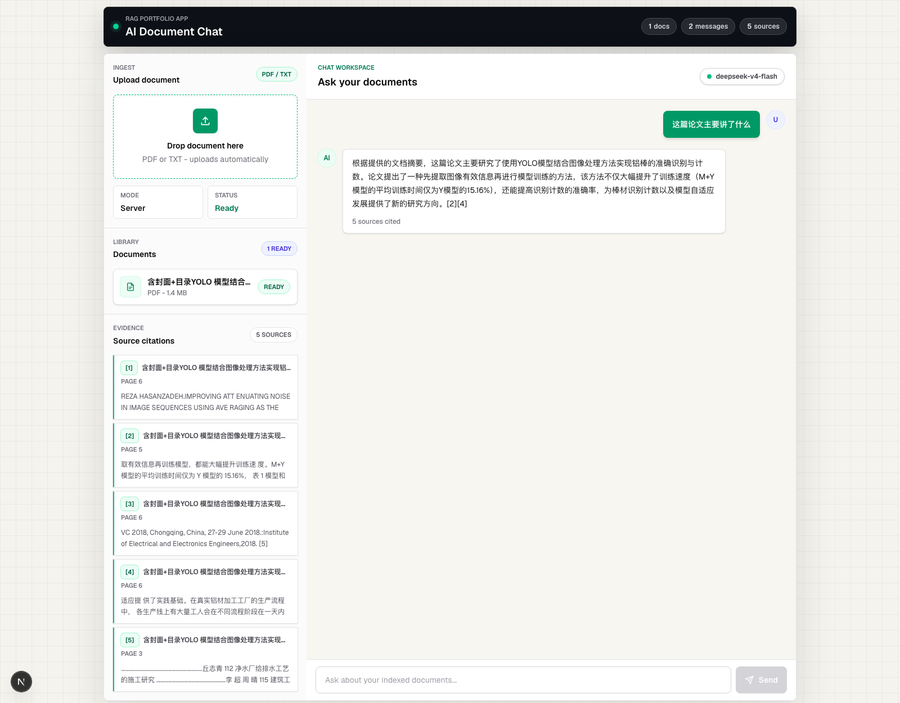
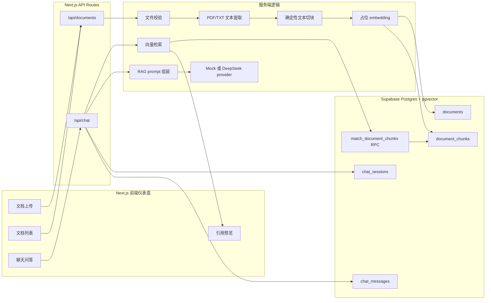

# AI 文档问答助手

这是一个适合放在简历里的全栈 RAG 文档问答项目。用户可以上传 PDF/TXT 文档，在页面里向文档提问，系统会基于检索到的原文片段生成回答，并展示对应的引用来源。

项目覆盖了文档上传、文本解析、文本切块、向量检索、LLM 问答编排、聊天记录持久化和仪表盘 UI。当前定位是本地可运行的作品集项目，不是生产级 SaaS 产品。

## 演示截图



更多本地演示截图：

- [完整页面截图](docs/screenshots/local-demo-full-page.png)
- [引用证据详情截图](docs/screenshots/local-demo-evidence-detail.png)

## 功能亮点

- 支持 PDF/TXT 文档上传接口。
- 支持 TXT 提取和基于 `pdf-parse` 的 PDF 文本提取。
- 使用确定性的文本切块逻辑，保留 chunk index 和 offset 等元数据。
- 使用 Supabase Postgres 存储文档、切块、聊天会话和聊天消息。
- 使用 `pgvector` 支持文档 chunk 的向量字段和相似度检索。
- 通过 `match_document_chunks` RPC 完成 RAG 检索。
- 通过可插拔的 chat provider 生成基于文档证据的回答。
- 支持 DeepSeek 兼容接口，密钥只放在服务端环境变量中。
- 提供 mock provider，方便本地开发和自动化测试，不消耗真实 API。
- 仪表盘 UI 包含文档上传、上传状态、文档列表、聊天区、加载/错误状态和引用预览。
- 覆盖单元测试、API route 测试、组件测试、数据库 schema 测试和 demo readiness 测试。

## 技术栈

- Next.js 16 App Router
- React 19
- TypeScript
- Tailwind CSS
- Supabase Postgres
- `pgvector`
- DeepSeek 兼容 chat provider
- `pdf-parse`
- Vitest
- Testing Library

## 系统架构



更多架构说明见 [docs/architecture.md](docs/architecture.md)。

## RAG 流程

1. 用户在仪表盘上传 PDF 或 TXT 文档。
2. 服务端校验文件类型、MIME type、PDF magic bytes 和 TXT 基础安全规则。
3. 服务端从文件中提取文本。
4. 文本被切成稳定、可追踪的 chunks。
5. 文档、chunks 和占位 embeddings 被写入 Supabase。
6. 用户在聊天界面提交问题。
7. 问题使用同一套占位 embedding provider 生成向量。
8. 应用调用 `match_document_chunks` 检索相关 chunk。
9. 检索结果被组装进 grounded RAG prompt。
10. 当前配置的 chat provider 返回回答。
11. 用户消息和助手回答被保存到 `chat_messages`。
12. 前端展示回答、引用来源和证据预览。

当前限制：embedding 还是确定性的占位实现，主要用于验证上传、解析、检索链路、持久化、prompt 组装和引用展示流程。后续可以替换成真实 embedding provider。

## 目录结构

```text
src/app/
  api/chat/                 RAG 聊天 API route
  api/documents/            文档上传/列表 API route
  page.tsx                  仪表盘入口
src/components/
  dashboard/                上传、文档列表、聊天和引用 UI
  layout/                   应用外壳
src/lib/
  documents/                文本提取和文本切块
  ingestion/                文件校验、文档入库、embedding
  rag/                      检索、prompt 组装、chat providers
  supabase/                 服务端 Supabase client 和数据库类型
supabase/migrations/        RAG 数据库 schema 和 RPC
docs/                       本地配置、演示、排错和架构文档
```

## 本地运行

```bash
npm install
cp .env.example .env.local
npm run dev
```

打开 [http://localhost:3000](http://localhost:3000)。

详细配置说明见 [docs/local-setup.md](docs/local-setup.md)。

不要提交 `.env.local`，它只应该保存本地私密凭据。

## 环境变量

使用 `.env.example` 作为模板，真实值放在 `.env.local`。

```bash
OPENAI_API_KEY=
NEXT_PUBLIC_SUPABASE_URL=
NEXT_PUBLIC_SUPABASE_ANON_KEY=
SUPABASE_SERVICE_ROLE_KEY=
LLM_PROVIDER=mock
DEEPSEEK_API_KEY=
DEEPSEEK_BASE_URL=https://api.deepseek.com
DEEPSEEK_CHAT_MODEL=deepseek-v4-flash
```

说明：

- `SUPABASE_SERVICE_ROLE_KEY` 只能在服务端使用。
- `DEEPSEEK_API_KEY` 只能在服务端使用。
- 只有 `NEXT_PUBLIC_` 开头的变量可以暴露给浏览器端代码。
- `LLM_PROVIDER=mock` 适合本地开发和测试，不会调用真实模型。
- `LLM_PROVIDER=deepseek` 会在存在私密 API key 时启用 DeepSeek chat provider。
- `OPENAI_API_KEY` 预留给后续真实 embedding provider，当前占位 embedding 流程不会使用它。

## Supabase 配置

本项目使用 Supabase Postgres 和 `pgvector` 保存文档、文本块、聊天记录，并支持向量检索。

1. 创建或打开一个 Supabase project。
2. 把 Supabase URL、anon key 和 service role key 写入 `.env.local`。
3. 在 Supabase SQL Editor 里运行 migration：

```text
supabase/migrations/20260603000100_create_rag_schema.sql
```

4. 确认以下表已创建：

- `documents`
- `document_chunks`
- `chat_sessions`
- `chat_messages`

5. 确认 `match_document_chunks` RPC 已创建。

该 migration 会启用 `pgvector`，创建 RAG 核心表，开启 RLS，并把当前 MVP 的向量检索 RPC 限制在 server-only 的 `service_role` 调用路径里。

## DeepSeek 配置

DeepSeek 是可选项。开发和测试时可以只使用 mock provider。

如果需要真实回答，在 `.env.local` 中私密配置：

```bash
LLM_PROVIDER=deepseek
DEEPSEEK_API_KEY=
DEEPSEEK_BASE_URL=https://api.deepseek.com
DEEPSEEK_CHAT_MODEL=deepseek-v4-flash
```

provider 使用 DeepSeek 的 OpenAI-compatible chat completions API。模型名称可以通过 `DEEPSEEK_CHAT_MODEL` 修改，不需要改应用代码。

## 演示流程

可以使用示例文档：

```text
docs/sample-documents/demo-notes.txt
```

建议提问：

```text
What does Project Atlas say about authentication and retrieval?
```

本地演示步骤：

1. 执行 `npm run dev` 启动应用。
2. 上传示例 TXT 文件。
3. 确认文档出现在左侧文档列表。
4. 输入建议问题并发送。
5. 确认助手回答出现。
6. 确认页面展示引用来源和证据预览。
7. 使用真实本地 Supabase 凭据时，确认聊天消息会保存到 Supabase。

完整检查清单见 [docs/demo-checklist.md](docs/demo-checklist.md)。

## 测试

```bash
npm run lint
npm run typecheck
npm test
npm run build
npm run verify
```

`npm run verify` 会依次运行 lint、typecheck、测试和生产构建。自动化测试使用 mock，不应该调用真实 DeepSeek 或真实 Supabase 服务。

## 安全说明

- 不要提交 `.env.local`。
- 不要把 `SUPABASE_SERVICE_ROLE_KEY` 暴露给客户端组件。
- 不要把 `DEEPSEEK_API_KEY` 暴露给客户端组件。
- API key 不应该出现在截图、日志、commit、issue 或 README 示例里。
- schema 已开启 RLS，当前 server-only MVP 的向量检索 RPC 做了权限限制。
- 项目暂未加入登录系统，所以应该把它当作本地作品集 demo，而不是多用户生产系统。

排错说明见 [docs/troubleshooting.md](docs/troubleshooting.md)。

## 已知限制

- embedding 目前是占位实现，不是生产级语义向量。
- 暂无登录系统和多用户工作区模型。
- 暂无文件存储 bucket，当前保存的是提取后的文本和 chunks，不保存原始文件。
- PDF 提取依赖可选择文本，不支持扫描版 PDF OCR。
- 项目还没有部署到线上环境。
- 项目优先服务本地作品集演示，不是生产运维项目。

## 后续改进

- 接入真实 embedding provider，并增加重新索引流程。
- 增加登录系统和按用户隔离的文档权限。
- 使用 Supabase Storage 保存原始文件。
- 支持流式聊天回答。
- 增强 PDF 页码和 offset 级别的引用元数据。
- 增加基于本地种子数据库的端到端浏览器测试。
- 在确定部署平台后补充部署文档。

## 简历描述参考

- 构建了一个基于 Next.js、TypeScript、Supabase Postgres、`pgvector` 和可插拔 LLM provider 的全栈 RAG 文档问答应用。
- 实现了 PDF/TXT 上传、文件校验、文本提取、确定性切块、向量持久化、语义检索 RPC 接入和引用来源展示。
- 设计了包含文档上传、文档状态、grounded chat、加载/错误状态和证据预览的仪表盘 UI。
- 增加了 server-only Supabase service-role 访问、环境变量安全处理、外部 provider mock 测试和本地 demo 验证套件。
