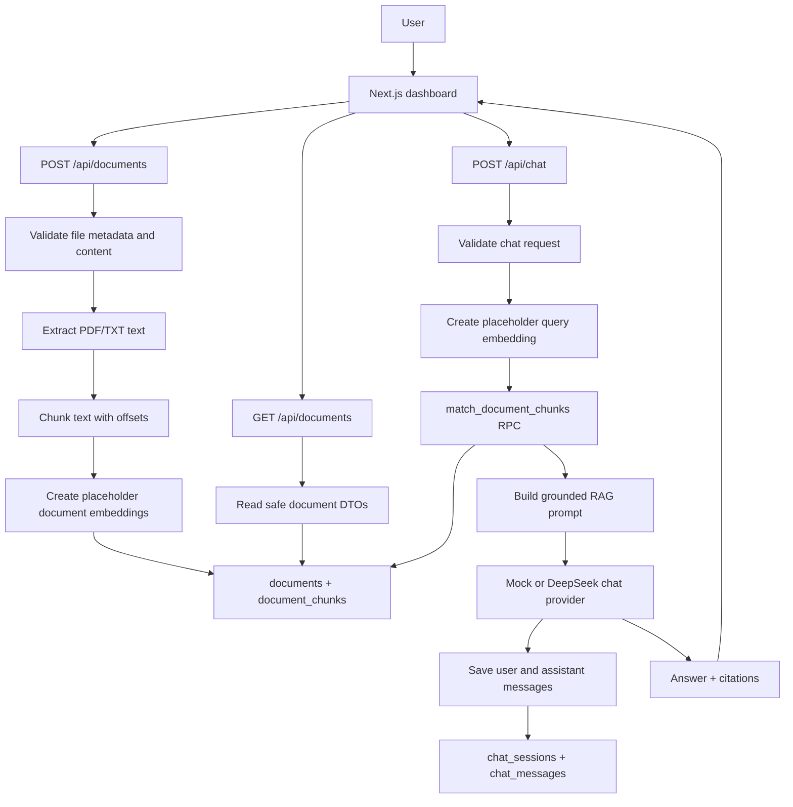

# Architecture

AI Document Chat is structured as a small full-stack RAG application. It keeps
the browser focused on user interaction and keeps credentials, ingestion,
retrieval, and provider calls on the server.

## System Diagram

## Server Boundaries

- Supabase service-role access lives in server-only modules.
- DeepSeek configuration is read only on the server.
- The browser calls application API routes, not Supabase service-role APIs or
  DeepSeek directly.
- `.env.local` stores private runtime credentials and must not be committed.

## Data Model

- `documents`: uploaded document metadata and extracted text length.
- `document_chunks`: chunk content, indexes, offsets, optional page numbers, and
  vector embeddings.
- `chat_sessions`: local chat sessions.
- `chat_messages`: user/assistant message history and citation metadata.

## Retrieval Boundary

The current retrieval pipeline uses deterministic placeholder embeddings. That
keeps the local demo deterministic and no-cost, but it is not intended to prove
production semantic ranking quality. The architecture is ready for a real
embedding provider to replace the placeholder implementation later.

## Provider Boundary

Chat generation is behind a `ChatProvider` interface:

- `mock`: safe default for local development and automated tests.
- `deepseek`: optional provider configured through server-side environment
  variables.

Automated tests mock providers and must not call real external services.
